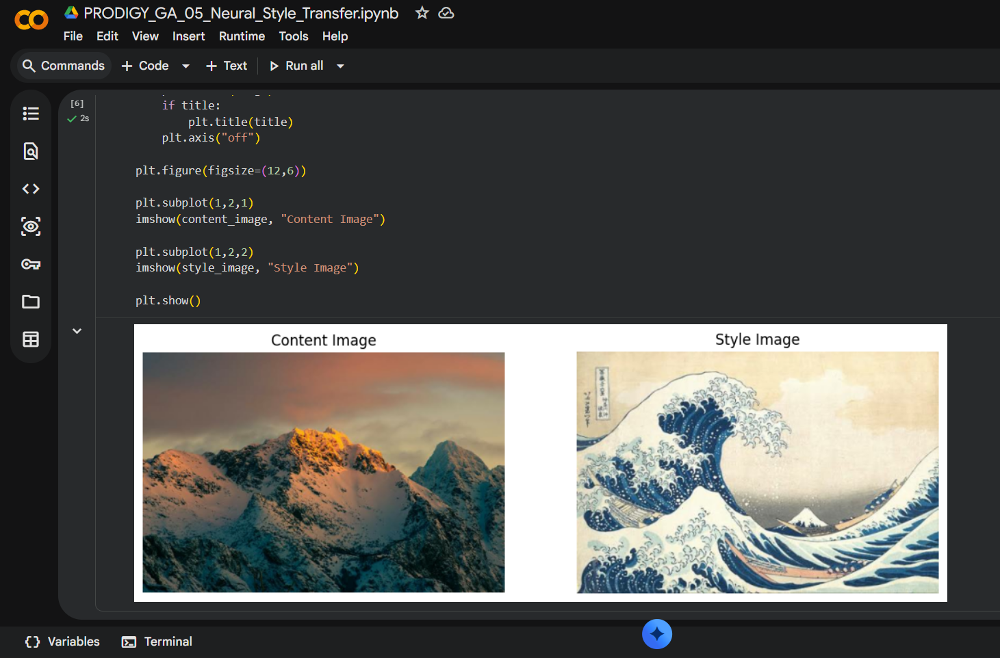
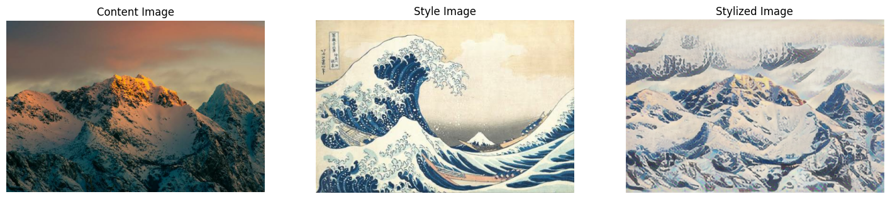
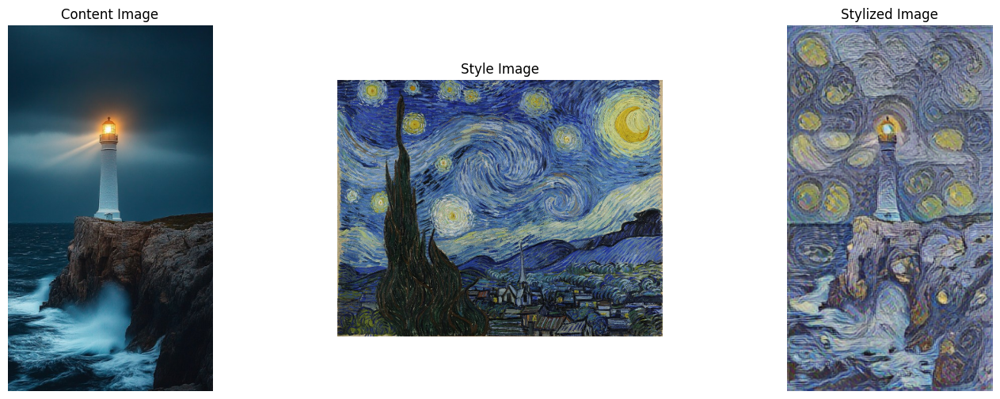
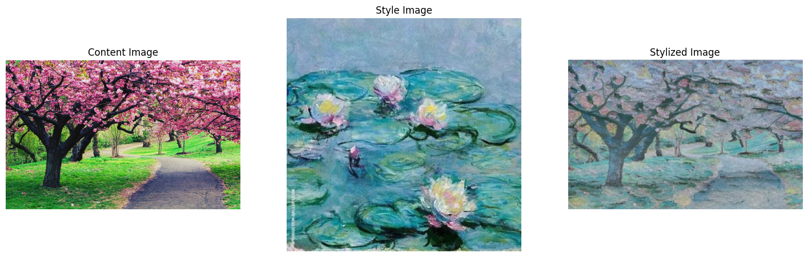

# Neural Style Transfer using TensorFlow

> **Task 05 - Generative AI Internship @ Prodigy InfoTech**

### Overview

This project demonstrates **Neural Style Transfer (NST)** using **TensorFlow** and **TensorFlow Hub**. Neural Style Transfer is a deep learning technique that combines the **content of one image** with the **artistic style of another**, producing visually appealing artwork while preserving the original scene.

A pre-trained **Arbitrary Image Stylization** model from TensorFlow Hub is used to apply different artistic styles to multiple content images.

---

### Project Objective

The objective of this project is to:

- Apply artistic styles from famous paintings to real-world photographs.
- Explore the concept of Neural Style Transfer using deep learning.
- Generate high-quality stylized images without training a model from scratch.
- Demonstrate style transfer on multiple content images.

---

### What is Neural Style Transfer?

Neural Style Transfer (NST) is a computer vision technique that separates and recombines two different aspects of images:

- **Content Image** → Defines the objects and structure.
- **Style Image** → Defines colors, textures, and artistic brush strokes.

The generated image preserves the original content while adopting the artistic appearance of the style image.

---

### Technologies Used

- Python
- TensorFlow
- TensorFlow Hub
- NumPy
- Matplotlib
- Pillow (PIL)
- Google Colab

---

## Results

### Example 1 – Snow-covered Mountain + The Great Wave

#### Content Image & Style Image

#### Stylized Output

---

### Example 2 – Lighthouse + The Starry Night

---

### Example 3 – Cherry Blossom Tree + Water Lilies

---

### Features

- Neural Style Transfer using a pre-trained TensorFlow Hub model
- Multiple artistic style transfer examples
- High-quality image stylization
- Easy-to-understand implementation
- Supports custom content and style images
- Executed using Google Colab

### Learning Outcomes

Through this project, I learned:

- The fundamentals of Neural Style Transfer
- The difference between content and style representations
- How TensorFlow Hub provides pre-trained deep learning models
- Image preprocessing and visualization techniques
- Applying artistic styles to multiple content images
- Working with TensorFlow in Google Colab

